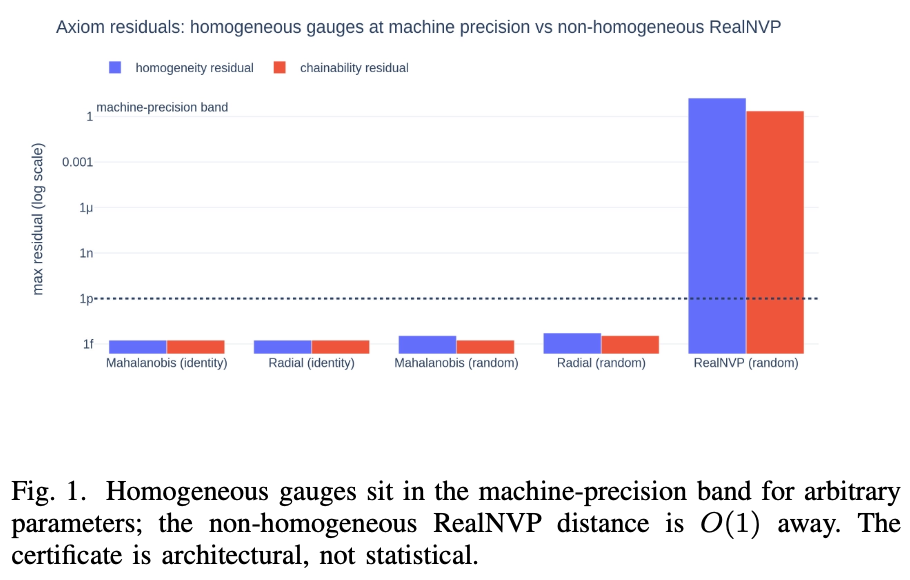
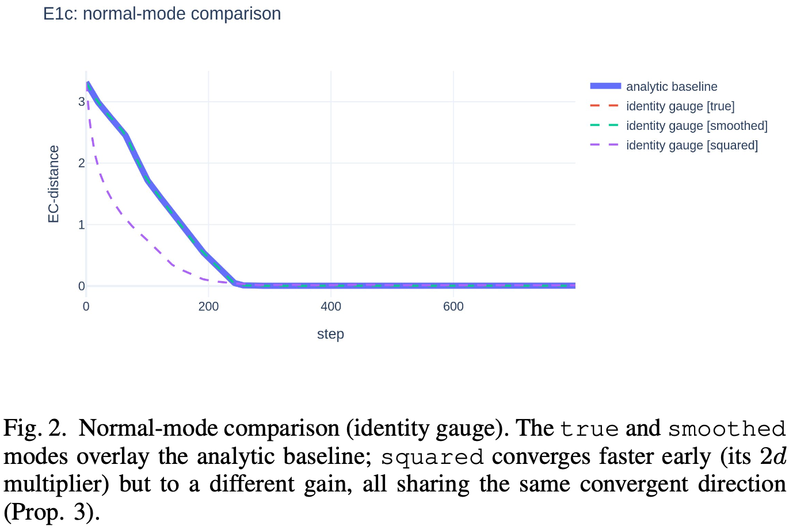
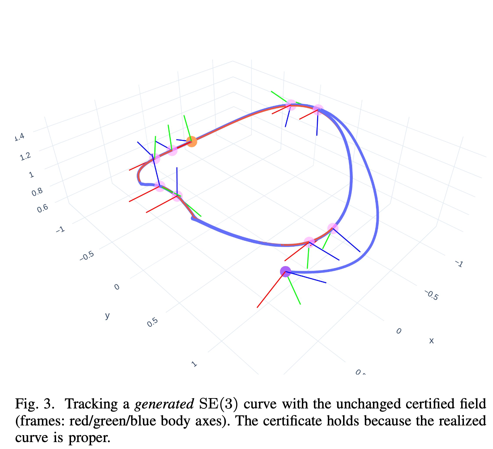

# FiGLi

This repository contains the official implementation for the paper:

> **"FiGLi: Finsler Gauge on Lie algebra for Guiding Vector Fields"**

## Overview

We show how to replace the fixed distance in constructive guiding vector fields (GVFs) with a **learnable, homogeneous Finsler gauge** on the Lie algebra $\mathfrak{se}(3)$. Unlike standard learned distances, our gauge satisfies the three axioms (left-invariance, chainability, local linearity) **by construction** — guaranteeing convergence to and traversal of the target curve at machine precision, even after learning.

- Homogeneous gauges (Mahalanobis, radial) keep axiom residuals at $\sim 10^{-15}$.
- Non-homogeneous baselines (RealNVP) remain $O(1)$ away — the quantitative meaning of an architectural certificate.
- Extensions to multi-robot formations, slowly time-varying curves, approximate nearest-pose search, and flow-matched generative curves.

## Experiments

